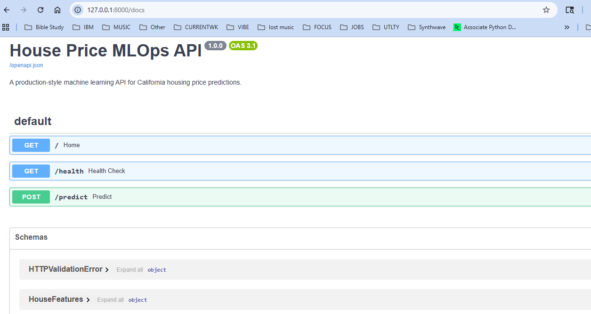

# House Price MLOps Pipeline

A production-style machine learning project that trains, evaluates, tracks, tests, and serves a house price prediction model using a reproducible MLOps workflow.

This project uses the California Housing dataset to predict median house value based on housing and location features. It demonstrates the full machine learning lifecycle: data ingestion, preprocessing, model training, experiment tracking, model persistence, API serving, automated testing, and containerization readiness.

---


## Project Screenshot



---


## Project Highlights

- End-to-end machine learning pipeline
- Data ingestion from scikit-learn's California Housing dataset
- Reproducible preprocessing workflow
- Random Forest regression model training
- Model evaluation with MAE, RMSE, and R²
- MLflow experiment tracking
- Saved model artifact with Joblib
- FastAPI prediction service
- Automated tests with pytest
- Docker-ready API deployment structure

---

## Tech Stack

- Python
- Pandas
- NumPy
- scikit-learn
- MLflow
- FastAPI
- Pydantic
- Pytest
- Joblib
- Docker
- Git / GitHub

---

## Project Structure

```text
house-price-mlops-pipeline/
├── app/
│   └── main.py                 # FastAPI prediction service
├── data/
│   ├── raw/                    # Raw dataset
│   └── processed/              # Train/test datasets
├── models/
│   └── house_price_model.joblib
├── reports/
│   └── metrics.json            # Model evaluation metrics
├── src/
│   ├── ingest_data.py          # Data ingestion script
│   ├── preprocess.py           # Data preprocessing script
│   ├── train.py                # Model training + MLflow tracking
│   └── predict.py              # Reusable prediction logic
├── tests/
│   ├── test_api.py             # FastAPI endpoint tests
│   └── test_data_pipeline.py   # Pipeline tests
├── requirements.txt
├── Dockerfile
├── .dockerignore
├── .gitignore
└── README.md
```

---

## Machine Learning Workflow

### 1. Data Ingestion

Loads the California Housing dataset and saves it as a raw CSV file.

```bash
python src/ingest_data.py
```

### 2. Data Preprocessing

Splits the dataset into training and testing files.

```bash
python src/preprocess.py
```

### 3. Model Training

Trains a Random Forest regression model, evaluates performance, saves the model artifact, and logs experiment metrics with MLflow.

```bash
python src/train.py
```

### 4. Prediction Script

Runs a sample prediction using the saved model.

```bash
python src/predict.py
```

Example output:

```text
{'predicted_house_value': 4.27}
```

The predicted value is in the California Housing dataset scale, where values are measured in hundreds of thousands of dollars.

## Model Comparison

This project compares multiple regression models to evaluate which algorithm performs best for California housing price prediction.

| Model | MAE | RMSE | R² |
|---|---:|---:|---:|
| Random Forest | 0.3275 | 0.5053 | 0.8051 |
| Gradient Boosting | 0.3716 | 0.5422 | 0.7756 |
| Linear Regression | 0.5332 | 0.7456 | 0.5758 |

The Random Forest model achieved the strongest overall performance, with the lowest RMSE and highest R² score.

Model comparison results are saved to:

```text
reports/model_comparison.csv
```


---

## Model Evaluation

The model is evaluated using:

- Mean Absolute Error
- Root Mean Squared Error
- R² Score

Evaluation results are saved to:

```text
reports/metrics.json
```

---

## MLflow Tracking

This project uses MLflow to track model experiments, parameters, metrics, and artifacts.

To open the MLflow UI:

```bash
mlflow ui
```

Then visit:

```text
http://127.0.0.1:5000
```

---

## FastAPI Prediction Service

Start the API server:

```bash
python -m uvicorn app.main:app --reload
```

Then open the interactive API documentation:

```text
http://127.0.0.1:8000/docs
```

### Prediction Endpoint

```http
POST /predict
```

Example request:

```json
{
  "MedInc": 8.3252,
  "HouseAge": 41.0,
  "AveRooms": 6.984127,
  "AveBedrms": 1.02381,
  "Population": 322.0,
  "AveOccup": 2.555556,
  "Latitude": 37.88,
  "Longitude": -122.23
}
```

Example response:

```json
{
  "input_features": {
    "MedInc": 8.3252,
    "HouseAge": 41.0,
    "AveRooms": 6.984127,
    "AveBedrms": 1.02381,
    "Population": 322.0,
    "AveOccup": 2.555556,
    "Latitude": 37.88,
    "Longitude": -122.23
  },
  "prediction": {
    "predicted_house_value": 4.27
  }
}
```

---

## Automated Testing

Run the full test suite:

```bash
python -m pytest
```

Current test coverage includes:

- API health check
- Home endpoint validation
- Prediction endpoint validation
- Data pipeline validation
- Model artifact creation

Current result:

```text
7 passed
```

---

## Docker Usage

Build the Docker image:

```bash
docker build -t house-price-mlops-api .
```

Run the container:

```bash
docker run -p 8000:8000 house-price-mlops-api
```

Then open:

```text
http://127.0.0.1:8000/docs
```

---

## Why This Project Matters

This project demonstrates more than basic model training. It shows the ability to build a production-style machine learning system with:

- Reproducible data workflows
- Experiment tracking
- Model artifact management
- API-based model serving
- Automated testing
- Deployment-ready structure

These are core skills used in production machine learning, MLOps, data science, and applied AI engineering roles.

---

## Future Improvements

Planned upgrades:

- Add GitHub Actions CI pipeline
- Add model performance comparison across algorithms
- Add Streamlit dashboard for predictions and metrics
- Add request/response logging
- Add model versioning workflow
- Deploy API to a cloud platform

---

## Author

Built as part of a production machine learning portfolio focused on real-world MLOps, model deployment, and API-based ML systems.
